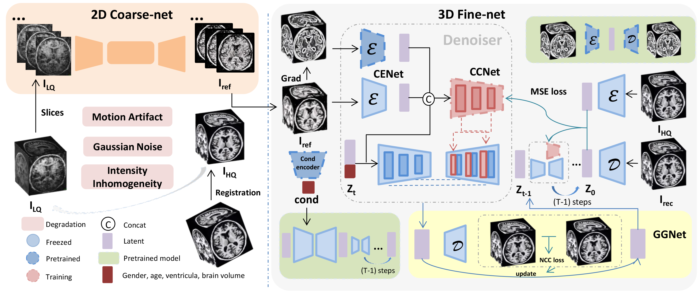
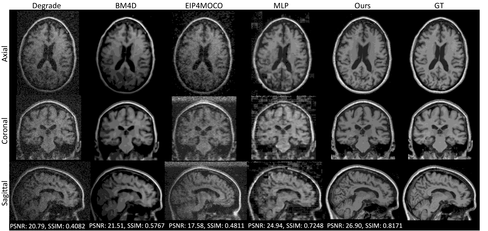
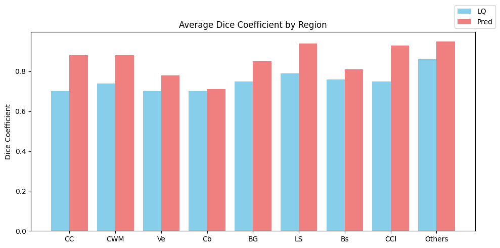

## **BMENet: 3D brain mri enhancement against various degradations with coarse to fine network**

Magnetic resonance imaging (MRI) is crucial for medical diagnosis but often suffers from various degradations, such as noise, motion artifacts, and intensity inhomogeneity, which can compromise image quality, leading to misdiagnoses or suboptimal treatment options, thereby affecting subsequent analyses. A wide variety of methods have been widely used for MRI image enhancement, yet they typically focus on generating two-dimensional (2D) slices or addressing a single type of degradation, limiting their flexibility and applicability. This paper proposes **BMENet**: a two-stage three-dimensional (3D) **B**rain **M**RI **E**nhancement **N**etwork, which designed to simultaneously handle denoising, artifact removal, and intensity inhomogeneity correction. At First stage, we use a 2D slice coarse enhancement model removes the bulk of the degradation; then second stage, a 3D fine control latent diffusion generation model restores missing details. Additionally, in the second stage, an edge-sensitive strategy is applied to prioritize the preservation of fine structural details at tissue boundaries, and a progressive constraint mechanism to guide recovery. 

### **Main Pipeline**

### **Data**

We utilize the publicly available ADNI dataset, comprising 211 T1-weighted MRI images acquired with a 3T scanner. The dataset is divided into training (146 images), validation (31 images), and testing sets (31 images). 

Initially, all data are rigidly registered to a standard space generated by BrainLDM (160 x 224 x 160) using FSL's *FLIRT*. Subsequently, our degradation model is applied to introduce one or more types of degradation. For each groundtruth image, seven varying degraded images are generated, facilitating paired image creation for training. All images are normalized to the range [0, 1]. For the first stage of training, images are sliced along the horizontal plane into 160 slices of 160 x 224 pixels each.

### **Train and Test**

Pretrained model: train_gradevae.py——train_gradevae.ymal ///  train_stage2_pretrain_cond.py——train_stage2.ymal

Train stage1: train_stage1.py——train_stage1.ymal

Train stage2: train_stage1.py——train_stage2.ymal

Test stage2: test_lq.py——test_stage2.ymal

### Results

Use fastsurfer do segmentation, result in Dice.

